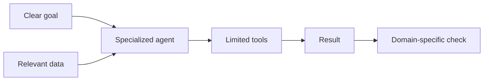

# Specialized Agents

> A **specialized agent** is designed for one type of work and receives only the tools, data, and permissions needed for that work.

Specialization is more than giving the model a role in a prompt. The tools and checks must also match the role.

## Short video

[](https://youtu.be/fXizBc03D7E "Five Types of AI Agents — IBM Technology")

## Basic design



## Useful specializations

| Agent | Tools | How to check it |
|---|---|---|
| **Browser agent** | Browser automation | Page state or screenshot |
| **Coding agent** | Editor, shell, tests | Tests, types, and diff review |
| **Data agent** | SQL and notebooks | Constraints and totals |
| **Research agent** | Search and document tools | Primary-source citations |
| **Document agent** | PDF/Office parsers | Rendered-page review |
| **Operations agent** | Logs and runbooks | Health check and rollback state |

## Browser agents

Browser agents can read pages, fill forms, and click controls. Prefer page roles and labels such as “Search” or “Submit” over screen coordinates because they are more stable.

Use screenshots when visual layout matters and structured page data when exact text or controls matter.

## Coding agents

A coding agent should receive:

- A clear issue or specification
- Only the relevant repository
- A disposable branch or sandbox
- Commands for tests and formatting
- A rule that deployment or merge needs approval

## Good design steps

1. Give the agent one clear role.
2. Provide only relevant information.
3. Give it a small set of task-specific tools.
4. Define an objective success check.
5. Set time, step, token, and cost limits.
6. Ask a human when the task is unclear or high impact.

## Common mistakes

- Calling an agent an “expert” without giving it expert tools or data
- Giving a database agent production write access by default
- Using vision clicks when stable page controls are available
- Accepting citations without checking the linked source
- Letting a coding agent access host secrets
- Retrying a broken website forever

### Write a role card

Specialize the system, not only the prompt. A role card makes an agent's data,
tools, permission boundary, and verifier reviewable:

```yaml
name: research-agent
goal: "Answer a question with current primary sources."
inputs: [question, date_range, trusted_domains]
tools: [web_search, fetch_page]
forbidden_tools: [shell, send_email, database_write]
output: claims.json
must_include: [claim, source_url, publication_date]
verify: check_claim_citations
stop_when: "Every factual claim has a source or is marked unknown."
```

Create one file per role and test that the application—not the prompt—actually
enforces the tool list.

### Ready-to-use verification commands

| Agent | Artifact | First checks to automate |
|---|---|---|
| Coding | Branch diff | `uv run pytest`, formatter, type check, `git diff --check` |
| Data | Query + result | Row count, null count, constraints, saved SQL |
| Research | Claims JSON | URL opens, date range, every claim has a source |
| Browser | Final page state | Expected URL, visible confirmation, saved screenshot |
| Document | `.docx` or PDF | Rendered pages, headings, links, page count |

For example, a coding agent can receive only the commands it needs:

```bash
uv run pytest tests/test_total.py
uv run ruff check src/
git diff --check
```

Do not give it a production deploy command because it can run tests.

### Keep or merge a specialist

Keep a dedicated agent only when it has a distinct input set, permission
boundary, or verifier. If two roles use the same context, tools, and checks,
use one simpler agent with routing instructions instead.

## References

- [Playwright locators](https://playwright.dev/python/docs/locators)
- [SWE-bench](https://www.swebench.com/)
- [OSWorld computer-use benchmark](https://os-world.github.io/)
- [OWASP Prompt Injection guidance](https://genai.owasp.org/llmrisk/llm01-prompt-injection/)
