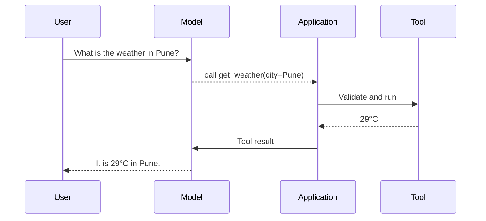

# Function / Tool Calling

> **Tool calling** lets a model ask an application to run a function.

The model does not execute the function. It returns the tool name and arguments; the application validates and runs them.

## Videos

[](https://youtu.be/h8gMhXYAv1k "What is Tool Calling? — IBM Technology")

[](https://youtu.be/gMeTK6zzaO4 "LLM Function Calling — AI Tools Deep Dive")

## How it works



## Tool definition

A tool needs three things:

- **Name:** what the function is called.
- **Description:** when the model should use it.
- **Schema:** which arguments are allowed.

```python
weather_tool = {
    "name": "get_weather",
    "description": "Get current weather for one city",
    "parameters": {
        "city": "string",
        "units": ["metric", "imperial"],
    },
}
```

Real model APIs use JSON Schema, but the simple example shows the idea.

## Built-in tools and custom tools

Providers can offer **built-in tools**: the provider operates the tool and the
application enables it. Examples include search, file retrieval, and a managed
code environment. You can also define a **custom function** whose code and
permissions you operate.

| Provider | Examples of built-in tools | Common use |
|---|---|---|
| OpenAI | Web search, file search, code interpreter, computer use | Current information, private-file retrieval, data analysis, UI work |
| Google Gemini | Google Search grounding, URL context, code execution | Current web information, reading supplied pages, calculations and charts |
| Anthropic | Web search and fetch, code execution, text editor, computer use | Research, controlled file work, and browser or desktop tasks |

This is a guide to the categories, not a promise that every tool is available
for every model, region, account, or API. Check the provider documentation and
the tool's data, billing, and retention rules before using it.

| Need | First choice | Why |
|---|---|---|
| Search the current public web | Provider search tool | It returns results and citations without building a crawler |
| Answer from approved private documents | Provider file/search tool or your retrieval service | The document boundary and access policy are explicit |
| Calculate, analyse a CSV, or make a chart | Managed code tool | It can execute and inspect code in a provider-managed environment |
| Call one application-specific API | Custom function | Your application keeps the validation and authorization boundary |
| Reuse a capability in several AI hosts | MCP server | One standard integration can serve compatible hosts |

Built-in does not mean harmless. A web result, fetched page, or uploaded file is
still untrusted input. A managed code environment still needs a review of what
data it receives and what files it returns. For a payment, production change,
or customer-data operation, keep the final permission and confirmation check in
your own application.

### A provider-neutral example

The orchestration pattern is the same whether the tool is built in or custom:

```text
User asks for this week's policy changes
→ model chooses web search
→ provider returns sources and excerpts
→ application records sources and checks its citation policy
→ model writes a cited summary
```

For a custom `refund_order` function, replace the provider step with your
application validating the arguments, checking the user and order, obtaining
approval, and calling the payment service. The model never becomes the
permission system.

## Good tool design

| Good | Avoid |
|---|---|
| One clear purpose | One tool that can do everything |
| Specific description | “Use this when needed” |
| Small set of arguments | Large free-form text input |
| Structured result | Result hidden in long prose |
| Clear error code | Raw stack trace |

## Parallel calls

Independent reads can run together:

```text
weather(Pune) ─┐
weather(Delhi) ├─ run together → combine results
weather(Kochi) ┘
```

Dependent actions must stay in order:

```text
find_order → show_refund_preview → user_approval → refund_order
```

### Tool calling is a contract

A tool call has two separate parts:

1. The **model proposes** a tool name and arguments.
2. The **application decides** whether the call is valid, allowed, and safe to
   execute.

The model can choose the wrong city, invent an order ID, or be influenced by
untrusted text. Therefore validation belongs in normal application code. Parse
the arguments against a strict schema, reject extra fields when appropriate,
enforce ranges and formats, then check the current user's permissions.

```text
Model proposal: refund_order(order_id="A-19", amount=50000)
Application: validate type → look up order → check ownership → check amount
             → show preview → require approval → call payment service
```

The model should never receive a general “run arbitrary code” or “make any HTTP
request” tool when a narrow operation will do.

### Design useful results

Tool results are context for the next model step. Return compact structured
data and a clear status, not a large HTML page or a human-only sentence.

```json
{
  "status": "ok",
  "order_id": "A-19",
  "eligible_for_refund": true,
  "maximum_amount": 799,
  "currency": "INR"
}
```

For a failure, use a safe category such as `NOT_FOUND`, `FORBIDDEN`,
`INVALID_ARGUMENT`, `CONFLICT`, or `TEMPORARY_FAILURE`. Include a short
correction when it is safe to do so. Avoid returning raw database errors,
internal paths, tokens, or stack traces.

### Read tools and write tools

| Kind | Example | Usual policy |
|---|---|---|
| Read | Get weather, search docs, list orders | Allow after identity and rate checks |
| Reversible write | Create a draft or temporary branch | Show result and keep an audit record |
| High-impact write | Send email, publish post, issue refund | Show a preview and require approval |
| Destructive write | Delete data or revoke access | Require strong confirmation and narrow scope |

Do not rely on a prompt saying “ask first.” The tool implementation should make
an approval token or confirmed action ID mandatory for high-impact operations.

### Reliability patterns

- **Timeout:** stop waiting for a slow dependency.
- **Retry:** retry only safe, temporary failures with a small limit and backoff.
- **Idempotency key:** lets the service recognize a repeated write request.
- **Pagination and result limits:** prevent one tool result from consuming the
  whole context window.
- **Audit record:** store who requested the tool, sanitized arguments, outcome,
  external ID, and time.

When a tool result is untrusted—for example, web search, email, or a document—
tell the model to treat it as data. It may contain text attempting to change the
agent's rules or persuade it to call another tool.

### Testing a tool

Test valid input, missing input, malformed input, a user without access, a
timeout, duplicate requests, and approval rejection. Also test the model-facing
description: can a human reading it predict exactly when it should be used and
what it cannot do? Clear contracts make tool calling safer and easier to debug.

## Safety checklist

- Allow only approved tools for the current user.
- Validate every argument before execution.
- Check permissions in application code, not in the prompt.
- Ask for confirmation before payments, deletion, messages, or publishing.
- Add timeouts and safe error messages.
- Use an idempotency key so a retry cannot repeat a payment or email.
- Treat web pages, files, and tool results as untrusted input.

## References

- [JSON Schema object reference](https://json-schema.org/understanding-json-schema/reference/object)
- [OpenAI tools guide](https://developers.openai.com/api/docs/guides/tools)
- [Gemini API tools](https://ai.google.dev/gemini-api/docs/code-execution)
- [Claude tool use](https://platform.claude.com/docs/en/agents-and-tools/tool-use/overview)
- [MCP tools specification](https://modelcontextprotocol.io/specification/2025-11-25/server/tools)
- [OWASP Prompt Injection guidance](https://genai.owasp.org/llmrisk/llm01-prompt-injection/)
