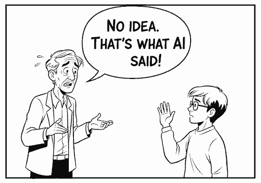
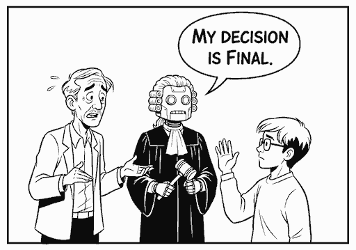

# Tools in Data Science - Jan 2026

[Tools in Data Science](https://study.iitm.ac.in/ds/course_pages/BSSE2002.html) is a diploma level data science course at IIT Madras.

**It bridges the gap between theory and real-world implementation**. Specifically: you'll learn what tools do data scientists actually use and how.

**It prepares you for AI**. AI is rapidly changing how data science work. You'll practice using AI to learn, execute, and explain data science tasks.

**AI will teach you**. We give you challenges. You learn by yourself, using AI & humans. **Self-learning is part of the course skills**.

**AI will evaluate you**. Since results vary each run, learn to answer them _robustly_. LLM decisions are **final**.

<!-- Source: https://gemini.google.com/app/8118aff285667319 -->

<strong>Anyone can audit this course. It's public.</strong>

Anyone can access this course content for free and submit assessments.

Those auditing can [use GitHub notifications](https://docs.github.com/en/subscriptions-and-notifications/get-started/configuring-notifications) and watch activity on the [course repository](https://github.com/sanand0/tools-in-data-science-public/).

Enrolled [IITM students](https://study.iitm.ac.in/ds/) can additionally participate in [Discourse](https://discourse.onlinedegree.iitm.ac.in/c/courses/tds-kb/34), get projects evaluated, take the final end-term, and get a certificate.

<strong>You MUST know Python, JavaScript, APIs, etc.</strong>

You need a _good_ understanding of Python, JavaScript, HTML, APIs, Excel, ChatGPT, and data science concepts.

Take the [Entrance Exam][EE]. IITM BS students scoring below 40% shouldn't register for this course (unless there's no choice).

<strong>It's a practical course. Just get it done. "How" matter less.</strong>

The course models **real-life**. Unclear problems, messy data, ridiculous deadlines, limited support.

Find your own unique ways of solving the problems. There's no one right approach.

<strong>It's a hard course. Take it in your last IITM BS Diploma term.</strong>

It's good for learning, maybe not for grades.

- In Jan 2025, [40% of the batch failed](https://discourse.onlinedegree.iitm.ac.in/t/when-should-i-take-tools-in-data-science/173268).
- [The ROE is intentionally impossible][hard]

Here's students' feedback from past terms:

- It _used_ to be an easy course until 2024.
  [#](https://discourse.onlinedegree.iitm.ac.in/t/difficulty-rating-for-diploma-subjects-based-on-students-opinion/61194)
  [#](https://discourse.onlinedegree.iitm.ac.in/t/difficulty-rating-for-diploma-subjects-2-0-based-on-student-ratings-and-my-experience/85681)
  [#](https://discourse.onlinedegree.iitm.ac.in/t/what-should-i-take-next/44291/6)
- Now it's hard and covers more. Take it in your last semester if possible.
  [#](https://discourse.onlinedegree.iitm.ac.in/t/diploma-course-feedback-t32024-and-course-selection-t12025-thread/160032/45)
  [#](https://discourse.onlinedegree.iitm.ac.in/t/2024-t1-diploma-level-feedback-and-course-selection-for-may-2024-term/127856/60)
  [#](https://discourse.onlinedegree.iitm.ac.in/t/2024-t2-diploma-level-feedback-and-course-selection-for-september-2024-term/144976/62?u=s.anand)
- Plan extra time. It takes more time than typical 3-credit courses.
  [#](https://discourse.onlinedegree.iitm.ac.in/t/concerns-regarding-unfair-grading-practices-for-tds-project-2/160611/11)
  [#](https://discourse.onlinedegree.iitm.ac.in/t/diploma-level-course-combo-suggestion/158460/4)
  [#](https://discourse.onlinedegree.iitm.ac.in/t/diploma-level-course-combo-suggestion/158460/7)
- LLMs grade you -- unpredictably.
  [#](https://discourse.onlinedegree.iitm.ac.in/t/concerns-regarding-unfair-grading-practices-for-tds-project-2/160611/10)
  [#](https://discourse.onlinedegree.iitm.ac.in/t/wrong-marks-in-project-2/160355/9)
- The ROE is hard.
  [#](https://discourse.onlinedegree.iitm.ac.in/t/is-it-fair-to-consider-20-weightage-of-such-exam-which-is-impossible-to-solve-in-given-time-i-e-roe/141413/10)
- [Should you take Tools in Data Science this term?](https://discourse.onlinedegree.iitm.ac.in/t/tools-in-data-science-should-you-take-tools-in-data-science-this-term/186454) (Ans: take it in your **last term**)

**[Take Graded assignment 1](https://exam.sanand.workers.dev/tds-2025-09-ga1) to check if you're ready for this course.** Please drop this course (do it in a later term) if you score low. It'll be too tough for you now.

But the learnings may be worth the effort.

- [May 2025 feedback](feedback-2025-05.md) indicates that students know it's hard -- and still rate the learning high.
- [Jan 2025 course experience](https://discourse.onlinedegree.iitm.ac.in/t/course-experience-and-farewell-post/173247) and farewell post.

---

<strong>Copying & ChatGPT are encouraged.</strong>

You _CAN_ copy from friends and AI. In fact, it's part of the curriculum.

Work in groups. You can use the Internet, WhatsApp, ChatGPT, your notes, your friends, your pets...

Share code. Even in projects, assignments, and exams (except the final in-person end-term exam).

- **Why copy?** Because in real life, there's no time to re-invent the wheel. You'll be working in teams on the shoulders of giants. It's important to learn how to do that well.
- **To learn well, understand** what you're copying. If you're short of time, prioritize.
- **To learn better, share** what you've learnt. Learn from others' feedback.

<strong>Check system requirements.</strong>

Check [system-requirements.md](system-requirements.md) for permissions you need, software to install, and websites to access. You may need to speak with your system administrator for access.

## 8 modules in 12 weeks

The course covers the typical data science workflow:

| [Content][Source]           | Assessment     | Weight |    Release Date | Submission Date |
| --------------------------- | -------------- | -----: | --------------: | --------------: |
| [Entrance Exam][EE]         | [**EE**][EE]   |     0% | Wed 07 Jan 2026 | Mon 02 Feb 2026 |
| Graded Assignment (GA)      | Best 5 of 8    |    20% |                 |                 |
| [Setup][GA1]                | [**GA1**][GA1] |        | Wed 28 Jan 2026 | Sun 15 Feb 2026 |
| [Deploy][GA2]               | [**GA2**][GA2] |        | Wed 04 Feb 2026 | Sun 22 Feb 2026 |
| [Source][GA3]               | [**GA3**][GA3] |        | Wed 18 Feb 2026 | Sun 01 Mar 2026 |
| [Wrangle][GA4]              | [**GA4**][GA4] |        | Wed 25 Feb 2026 | Sun 08 Mar 2026 |
| [Analyze][GA5]              | [**GA5**][GA5] |        | Wed 04 Mar 2026 | Fri 20 Mar 2026 |
| [Test][GA6]                 | [**GA6**][GA6] |        | Wed 11 Mar 2026 | Sun 22 Mar 2026 |
| [Present][GA7]              | [**GA7**][GA7] |        | Wed 18 Mar 2026 | Sun 29 Mar 2026 |
| [Package][GA8]              | [**GA8**][GA8] |        | Wed 25 Mar 2026 | Wed 08 Apr 2026 |
| [Project 1][P1]             | [**P1**][P1]   |    20% |  Fri 6 Feb 2026 | Mon 30 Mar 2026 |
| [Project 2][P2]             | [**P2**][P2]   |    20% |  Fri 6 Mar 2026 | Mon 13 Apr 2026 |
| Remote Online Exam ([hard]) | [**ROE**][ROE] |    20% | Sat 28 Mar 2026 | Sat 28 Mar 2026 |
| Final end-term (in-person)  | F              |    20% | Sun 10 May 2026 | Sun 10 May 2026 |

[Source]: https://github.com/sanand0/tools-in-data-science-public/commits
[EE]: https://exam.sanand.workers.dev/tds-2026-01-ee
[GA1]: https://exam.sanand.workers.dev/tds-2026-01-ga1-tools
[GA2]: https://exam.sanand.workers.dev/tds-2026-01-ga2-deploy
[GA3]: https://exam.sanand.workers.dev/tds-2026-01-ga3-source
[GA4]: https://exam.sanand.workers.dev/tds-2026-01-ga4-wrangle
[GA5]: https://exam.sanand.workers.dev/tds-2026-01-ga5-analyze
[GA6]: https://exam.sanand.workers.dev/tds-2026-01-ga6-test
[GA7]: https://exam.sanand.workers.dev/tds-2026-01-ga7-present
[GA8]: https://exam.sanand.workers.dev/tds-2026-01-ga8-package
[P1]: #TODO
[P2]: #TODO
[ROE]: https://exam.sanand.workers.dev/tds-2026-01-roe
[hard]: https://discourse.onlinedegree.iitm.ac.in/t/roe-prep-discussion-thread-tds-may-2025/181581/25

**Notes**

- **We may post bonus activities on Discourse**. See [previous bonus activities](https://discourse.onlinedegree.iitm.ac.in/tags/c/courses/tds-kb/34/bonus-marks)

## Resources

| Resource                      | IITM                                                                                                                                        | Public                                                                        |
| ----------------------------- | ------------------------------------------------------------------------------------------------------------------------------------------- | ----------------------------------------------------------------------------- |
| Live Video Sessions           | [YouTube](https://www.youtube.com/@se-lr5ff)                                                                                                | [Archives](live-sessions.md)                                                  |
| Discussion                    | [IITM](https://discourse.onlinedegree.iitm.ac.in/c/courses/tds-kb/34)                                                                       | [Public](https://github.com/sanand0/tools-in-data-science-public/discussions) |
| Course page - Jan 2026        | [IITM](https://seek.onlinedegree.iitm.ac.in/courses/ns_26t1_se2002)                                                                         | [Public](https://tds.s-anand.net/)                                            |
| Announcement group - Jan 2026 | [IITM](https://groups.google.com/a/study.iitm.ac.in/g/26t1_se2002-announce)                                                                 | [Public](https://groups.google.com/g/tds-iitm)                                |
| Grading Document - Jan 2026   | #TODO                                                                                                                                       |                                                                               |
| Student Handbook              | [IITM](https://docs.google.com/document/u/2/d/e/2PACX-1vRxGnnDCVAO3KX2CGtMIcJQuDrAasVk2JHbDxkjsGrTP5ShhZK8N6ZSPX89lexKx86QPAUswSzGLsOA/pub) |                                                                               |

## Contacts

- **Faculty** creates content: [Anand S](https://www.linkedin.com/in/sanand0/),
  [root.node@gmail.com](mailto:root.node@gmail.com) |
  [@s.anand](https://discourse.onlinedegree.iitm.ac.in/u/s.anand)
- **Instructors** teach the course:
  - Carlton D'Silva,
    [22f3001919@ds.study.iitm.ac.in](mailto:22f3001919@ds.study.iitm.ac.in) |
    [@carlton](https://discourse.onlinedegree.iitm.ac.in/u/carlton)
  - [Prasanna S](https://www.linkedin.com/in/prasanna-sugumaran-ab980222/),
    [prasanna@study.iitm.ac.in](mailto:prasanna@study.iitm.ac.in) |
    [@iamprasna](https://discourse.onlinedegree.iitm.ac.in/u/iamprasna)
- **Teaching assistants** answer your doubts:
  - Hritik Roshan Maurya,
    [22f3002460@ds.study.iitm.ac.in](mailto:22f3002460@ds.study.iitm.ac.in) |
    [@HritikRoshan_HRM](https://discourse.onlinedegree.iitm.ac.in/u/hritikroshan_hrm)
  - Jivraj Singh,
    [22f3002542@ds.study.iitm.ac.in](mailto:22f3002542@ds.study.iitm.ac.in) |
    [@Jivraj](https://discourse.onlinedegree.iitm.ac.in/u/jivraj) |
    [LinkedIn](https://www.linkedin.com/in/jivraj-singh-shekhawat-92a547269/)
  - Mayank Poddar,
    [23f3004197@ds.study.iitm.ac.in](mailto:23f3004197@ds.study.iitm.ac.in) |
    [@23f3004197](https://discourse.onlinedegree.iitm.ac.in/u/23f3004197) |
    [LinkedIn](https://www.linkedin.com/in/mynkpdr)
  - [Virtual TA](https://chatgpt.com/g/g-mZqKVxKDx-iitm-tds-teaching-assistant)
    ([GPT Instructions](tds-ta-instructions.md))

## Check communications

Check these three links regularly to keep up with the course.

1. **[Seek Notifications](https://seek.onlinedegree.iitm.ac.in/)** for Course Notifications. Log into [seek.onlinedegree.iitm.ac.in](https://seek.onlinedegree.iitm.ac.in/) and click on the bell icon on the top right corner. Check notifications daily.
   
2. **[Your email](https://mail.google.com/)** for Course Announcements. [Seek](https://seek.onlinedegree.iitm.ac.in/) Inbox are forwarded to your email. Check daily. Check spam folders too.
3. **[TDS Discourse](https://discourse.onlinedegree.iitm.ac.in/c/courses/tds-kb/34)**: Faculty, instructors, and TAs will share updates and address queries here. Email [support@study.iitm.ac.in](mailto:support@study.iitm.ac.in) cc: [discourse-staff1@study.iitm.ac.in](mailto:discourse-staff1@study.iitm.ac.in) if you can't access Discourse.

## Previous terms

- [TDS: Course Content - Sep 2025](2025-09/)
- [TDS: Course Content - May 2025](2025-05/)
  - [Community solutions](https://tdsfu.pages.dev/)
- [TDS: Course Content - Jan 2025](2025-01/)
