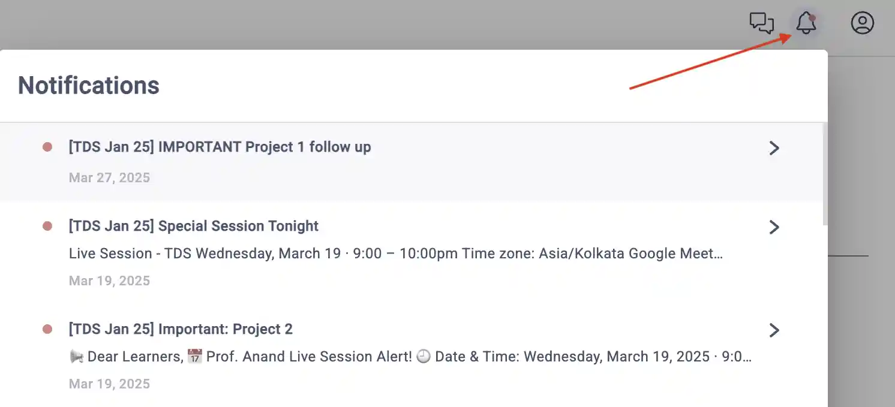

# Tools in Data Science - May 2025

[Tools in Data Science](https://study.iitm.ac.in/ds/course_pages/BSSE2002.html) is a practical diploma level data science course at IIT Madras that teaches
popular tools for sourcing data, transforming it, analyzing it, communicating these as visual stories, and deploying them in production.

<strong>This course exposes you to real-life tools</strong>

Courses teach you programming and data science. From statistics to algorithms to writing Python code to building models.

But one critical subject that's rarely covered is: what tools should I pick and how do I become proficient in them?

These tools might not help your CV much. But they will make things easier in real life. For example, at school:

- You learn from pristine datasets. But in the industry, you'll have to scrape them yourself.
- You learn how to train models. But soon, you'll just pick something from HuggingFace.
- You learn to write a log parser over weeks. Instead, your boss writes a `sed` + `grep` script in minutes.

[ "We lost the documentation on quantum mechanics. You'll have to decode the regexes yourself."](https://explainxkcd.com/224/)

In this course, we've curated the most important tools people use in data science.

Learn them well. You'll be a **_lot_ more productive** than your peers.

<strong>This course is quite hard</strong>

Here's students' feedback:

- [2 out of 5 students in the Jan 2025 batch failed](https://discourse.onlinedegree.iitm.ac.in/t/when-should-i-take-tools-in-data-science/173268)
- It _used_ to be an easy course until 2024.
  [#](https://discourse.onlinedegree.iitm.ac.in/t/difficulty-rating-for-diploma-subjects-based-on-students-opinion/61194)
  [#](https://discourse.onlinedegree.iitm.ac.in/t/difficulty-rating-for-diploma-subjects-2-0-based-on-student-ratings-and-my-experience/85681)
  [#](https://discourse.onlinedegree.iitm.ac.in/t/what-should-i-take-next/44291/6)
- Now it's hard and covers more. Take it in your last semester if possible.
  [#](https://discourse.onlinedegree.iitm.ac.in/t/diploma-course-feedback-t32024-and-course-selection-t12025-thread/160032/45)
  [#](https://discourse.onlinedegree.iitm.ac.in/t/2024-t1-diploma-level-feedback-and-course-selection-for-may-2024-term/127856/60)
  [#](https://discourse.onlinedegree.iitm.ac.in/t/2024-t2-diploma-level-feedback-and-course-selection-for-september-2024-term/144976/62?u=s.anand)
- Plan extra time. It takes more time than typical 3-credit courses.
  [#](https://discourse.onlinedegree.iitm.ac.in/t/concerns-regarding-unfair-grading-practices-for-tds-project-2/160611/11)
  [#](https://discourse.onlinedegree.iitm.ac.in/t/diploma-level-course-combo-suggestion/158460/4)
  [#](https://discourse.onlinedegree.iitm.ac.in/t/diploma-level-course-combo-suggestion/158460/7)
- LLMs grade you -- unpredictably.
  [#](https://discourse.onlinedegree.iitm.ac.in/t/concerns-regarding-unfair-grading-practices-for-tds-project-2/160611/10)
  [#](https://discourse.onlinedegree.iitm.ac.in/t/wrong-marks-in-project-2/160355/9)
- The ROE is hard.
  [#](https://discourse.onlinedegree.iitm.ac.in/t/is-it-fair-to-consider-20-weightage-of-such-exam-which-is-impossible-to-solve-in-given-time-i-e-roe/141413/10)

**[Take Graded assignment 1](https://exam.sanand.workers.dev/tds-2025-05-ga1) to check if you're ready for this course.** Please drop this course (do it in a later term) if you score low. It'll be too tough for you now.

<strong>But it's probably worth it.</strong>

Here's students' feedback:

- [Course experience and farewell post](https://discourse.onlinedegree.iitm.ac.in/t/course-experience-and-farewell-post/173247)

<strong>Programming skills are a pre-requisite</strong>

You need a _good_ understanding of Python, JavaScript, HTML, HTTP, Excel, and data science concepts.

**But isn't this a data science course?** Yes. Good data scientists are good programmers. Data scientists don't just analyze data or train models. They source data, clean it, transform it, visualize it, deploy it, and automate the whole process.

In some organizations, some of this work is done by others (e.g. data engineers, IT teams, etc.). But wherever you are, _some_ of the time, you need to write code for all of this yourself.

This course teaches you tools that will make you more productive. But you _do_ need programming to learn many of them.

<strong>If you passed, don't enroll again</strong>

The course is public, so you can always audit it.

Also, registering again for the course [does not improve marks much](https://discourse.onlinedegree.iitm.ac.in/t/why-you-should-almost-never-register-for-tds-improvement-if-you-have-passed-it/173625).

<strong>We encourage learning by sharing</strong>

You _CAN_ copy from friends. You can work in groups. You can share code. Even in projects, assignments, and exams (except the final end-term exam).

**Why should you copy?** Because in real life, there's no time to re-invent the wheel. You'll be working in teams on the shoulders of giants. It's important to learn how to do that well.

**To learn well, understand** what you're copying. If you're short of time, prioritize.

**To learn better, teach** what you've learnt.

## We cover 7 modules in 12 weeks

The content evolves with technology and feedback.
Track the [commit history](https://github.com/sanand0/tools-in-data-science-public/commits/tds-2025-01/) for changes.

1. **[Development Tools](development-tools.md)** and concepts to **build** models and apps.
2. **[Deployment Tools](deployment-tools.md)** and concepts to **publish** what you built.
3. **[Large Language Models](large-language-models.md)** that make your work easier and your apps smarter.
4. **[Data Sourcing](data-sourcing.md)** to get data from the web, files, and databases.
5. **[Data Preparation](data-preparation.md)** to clean up and convert the inputs to the right format.
6. **[Data Analysis](data-analysis.md)** to find surprising insights in the data.
7. **[Data Visualization](data-visualization.md)** to communicate those insights as visual stories.

## Anyone can audit this course

Everyone has access to:

- Course content at <https://tds.s-anand.net/>
- [Evaluations](#evaluations-are-mostly-open-internet)

You can solve these questions any time and check your answers before the submission dates.

Only [enrolled students](https://study.iitm.ac.in/ds/) can participate in [Discourse](https://discourse.onlinedegree.iitm.ac.in/c/courses/tds-kb/34), get project evaluations, take the final end-term, or get a certificate.

Those auditing can join the [TDS 2025 May Google Group](https://groups.google.com/g/tds-2025-05) for announcements.

## Evaluations are mostly open Internet

Tentative dates:

| Exam                                       | Type                     | Weight |          Release Date |       Submission Date |
| ------------------------------------------ | ------------------------ | -----: | --------------------: | --------------------: |
| GA: Graded assignments                     | Best 4 out of 7          |    15% |                       |                       |
| [Graded Assignment 1][GA1] [Discuss][GA1D] | Online open-Internet MCQ |        |       Thu 01 May 2025 |       Sun 18 May 2025 |
| [Graded Assignment 2][GA2] [Discuss][GA2D] | Online open-Internet MCQ |        |       Thu 05 May 2025 |       Sun 25 May 2025 |
| [Graded Assignment 3][GA3] [Discuss][GA3D] | Online open-Internet MCQ |        |       Fri 20 May 2025 |       Sun 01 Jun 2025 |
| P1: Project 1                              | Online open-Internet     |    20% |       Fri 16 May 2025 |       Sat 14 Jun 2025 |
| Graded Assignment 4                        | Online open-Internet MCQ |        |       Wed 11 Jun 2025 |       Sun 22 Jun 2025 |
| Graded Assignment 5                        | Online open-Internet MCQ |        |       Wed 18 Jun 2025 |       Sun 29 Jun 2025 |
| Graded Assignment 6                        | Online open-Internet MCQ |        |       Wed 02 Jul 2025 |       Sun 13 Jul 2025 |
| ROE: Remote Online Exam                    | Online open-Internet MCQ |    20% | Sun 20 Jul 2025 13:00 | Sun 20 Jul 2025 13:45 |
| Graded Assignment 7                        | Online open-Internet MCQ |        |       Wed 16 Jul 2025 |       Sun 27 Jul 2025 |
| P2: Project 2                              | Online open-Internet     |    20% |       Fri 11 Jul 2025 |        Fri 8 Aug 2025 |
| F: Final end-term                          | In-person, no internet   |    25% |       Sun 31 Aug 2025 |       Sun 31 Aug 2025 |

[GA1]: https://exam.sanand.workers.dev/tds-2025-05-ga1
[GA2]: https://exam.sanand.workers.dev/tds-2025-05-ga2
[GA3]: https://exam.sanand.workers.dev/tds-2025-05-ga3
[GA1D]: https://discourse.onlinedegree.iitm.ac.in/t/ga1-development-tools-discussion-thread-tds-may-2025/173524
[GA2D]: https://discourse.onlinedegree.iitm.ac.in/t/ga2-deployment-tools-discussion-thread-tds-may-2025/173525
[GA3D]: https://discourse.onlinedegree.iitm.ac.in/t/ga3-large-language-models-discussion-thread-tds-may-2025/175592

Updates:

- 5 May 2025:
  - GA1 submission date postponed from 11 May to 18 May 2025
  - GA2 submission date postponed from 18 May to 25 May 2025
  - ~~GA3 submission date **preponed** from 01 Jun to 25 May 2025 since there's a break the week after~~

### Notes

- **[Graded Assignment 1][GA1] checks course pre-requisites**. Please drop this course (do it in a later term) if you score low. It'll be too tough for you now.
- **Remote exams are open and hard**
  - You can use the Internet, WhatsApp, ChatGPT, your notes, your friends, your pets...
  - The RoE is especially hard. Read: [What is the purpose of an impossible RoE exam?](https://discourse.onlinedegree.iitm.ac.in/t/whats-the-actual-purpose-of-impossible-roe-exam/99838/2)
- **Final exam is in-person and closed book**. It tests your memory. It's easy.
- **Projects test application**. The projects test how well you apply what you learnt in a real-world context.
- **Bonus activities may be posted on Discourse**. See [previous bonus activities](https://discourse.onlinedegree.iitm.ac.in/tags/c/courses/tds-kb/34/bonus-marks)
- **Evaluations are mostly automated**. This course uses pre-computed (for objective) or LLMs (for subjective) evaluations.
  - LLMs will evaluate you differently each time. Learn to prompt them _robustly_ to get higher marks.

## Constantly check communications

Check these three links regularly to keep up with the course.

1. **[Seek Notifications](https://seek.onlinedegree.iitm.ac.in/)** for Course Notifications. Log into [seek.onlinedegree.iitm.ac.in](https://seek.onlinedegree.iitm.ac.in/) and click on the bell icon :bell: on the top right corner :arrow_upper_right:. Check notifications daily.
   
2. **[Your email](https://mail.google.com/)** for Course Announcements. [Seek](https:/seek.onlinedegree.iitm.ac.in/) Inbox are forwarded to your email. Check daily. Check spam folders too.
3. **[TDS Discourse](https://discourse.onlinedegree.iitm.ac.in/c/courses/tds-kb/34)**: Faculty, instructors, and TAs will share updates and address queries here. Email [support@study.iitm.ac.in](mailto:support@study.iitm.ac.in) cc: [discourse-staff1@study.iitm.ac.in](mailto:discourse-staff1@study.iitm.ac.in) if you can't access Discourse.

## People who help you

- **Faculty** (who design the course)
  - [Anand S](https://www.linkedin.com/in/sanand0/),
    [root.node@gmail.com](mailto:root.node@gmail.com) |
    [@s.anand](https://discourse.onlinedegree.iitm.ac.in/u/s.anand)
- **Instructors** (who teach the course)
  - Carlton D'Silva.
    [22f3001919@ds.study.iitm.ac.in](mailto:22f3001919@ds.study.iitm.ac.in) |
    [@carlton](https://discourse.onlinedegree.iitm.ac.in/u/carlton)
  - [Prasanna S](https://www.linkedin.com/in/prasanna-sugumaran-ab980222/),
    [prasanna@study.iitm.ac.in](mailto:prasanna@study.iitm.ac.in) |
    [@iamprasna](https://discourse.onlinedegree.iitm.ac.in/u/iamprasna)
- **Teaching assistants** (who help you with your doubts)
  - Jivraj Singh,
    [22f3002542@ds.study.iitm.ac.in](mailto:22f3002542@ds.study.iitm.ac.in) |
    [@Jivraj](https://discourse.onlinedegree.iitm.ac.in/u/jivraj) |
    [LinkedIn Profile](https://www.linkedin.com/in/jivraj-singh-shekhawat-92a547269/)
  - Suchintika Sarkar,
    [21f3002441@ds.study.iitm.ac.in](mailto:21f3002441@ds.study.iitm.ac.in) |
    [@21f3002441](https://discourse.onlinedegree.iitm.ac.in/u/21f3002441)
  - Hritik Roshan Maurya,
    [22f3002460@ds.study.iitm.ac.in](mailto:22f3002460@ds.study.iitm.ac.in) |
    [@HritikRoshan_HRM](https://discourse.onlinedegree.iitm.ac.in/u/hritikroshan_hrm)
  - Saransh Saini,
    [22f1001123@ds.study.iitm.ac.in](mailto:22f1001123@ds.study.iitm.ac.in) |
    [@Saransh_Saini](https://discourse.onlinedegree.iitm.ac.in/u/Saransh_Saini) |
    [LinkedIn Profile](https://www.linkedin.com/in/saranshsaini48/)
  - [Virtual TA](https://chatgpt.com/g/g-mZqKVxKDx-iitm-tds-teaching-assistant)
    ([GPT Instructions](tds-ta-instructions.md))

<!--
- Mahesh Balan U (MS, PhD - IIT Madras)
- Dixon Prem Daniel (PhD - IIT Madras)
- Ravi Teja (MS - IIT Madras)
- Sathiesh (MS - IIT Madras)
- Rohith Srinivaas M (B.Tech, M.Tech - IIT Madras)

- [Amit Kumar Gupta](https://www.linkedin.com/in/amit-gupta-321994252/) (B.Sc. Delhi University).
  [21f1005763@ds.study.iitm.ac.in](mailto:21f1005763@ds.study.iitm.ac.in) |
  [@Amit1](https://discourse.onlinedegree.iitm.ac.in/u/Amit1)

-->

Their **job** is to help you. Trouble them for your slightest doubts!

## Course Links

- [TDS: Discourse](https://discourse.onlinedegree.iitm.ac.in/c/courses/tds-kb/34) - Ask questions, get help, and discuss with your peers.
- [IITM BS Degree Programme - Student Handbook](https://docs.google.com/document/u/2/d/e/2PACX-1vRxGnnDCVAO3KX2CGtMIcJQuDrAasVk2JHbDxkjsGrTP5ShhZK8N6ZSPX89lexKx86QPAUswSzGLsOA/pub)
- [TDS: Public course page](https://study.iitm.ac.in/ds/course_pages/BSSE2002.html)
- [TDS: Course files](https://drive.google.com/drive/folders/1FE0YPAxcxMzZdjnp3FopuJCI3A2Vq6fC?usp=drive_link) -- Jupyter notebooks, datasets, etc.

## May 2025 Links

- [Grading Document - May 2025](https://docs.google.com/document/u/3/d/e/2PACX-1vRKOWaLjxsts3qAM4h00EDvlB-GYRSPqqVXTfq3nGWFQBx91roxcU1qGv2ksS7jT4EQPNo8Rmr2zaE9/pub#h.2bn6wsx)
- [TDS: Course page - May 2025](https://seek.onlinedegree.iitm.ac.in/courses/ns_25t2_se2002) -- for students to access course content.
- [TDS: Announcement group - May 2025](https://groups.google.com/a/study.iitm.ac.in/g/25t2_se2002-announce)
- [TDS: Live Sessions](https://www.youtube.com/@se-lr5ff/streams)

<!--

- [Back-end for configuring the lessons](https://cb-prod.seek.study.iitm.ac.in/25t1_se2002/)

-->

## Past Course Content

- [TDS: Course Content - Jan 2025](2025-01/)
- [TDS: Live Sessions - Jan 2025](https://www.youtube.com/playlist?list=PL_h5u1jMeBCl1BquBhgunA4t08XAxsA-C) -- YouTube playlist
- [TDS: Course calendar - Jan 2025](https://calendar.google.com/calendar/u/0/r?cid=Y19ib2Y3bnMxbDduNm84azA1dHA4YTlxNWIwZ0Bncm91cC5jYWxlbmRhci5nb29nbGUuY29t)
- [Grading Document - Jan 2025](https://docs.google.com/document/d/e/2PACX-1vRBH1NuM3ML6MH5wfL2xPiPsiXV0waKlUUEj6C7LrHrARNUsAEA1sT2r7IHcFKi8hvQ45gSrREnFiTT/pub).
