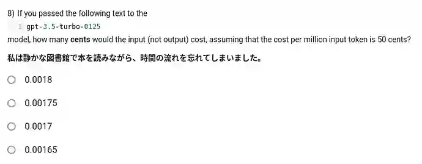

# Project: TDS Virtual TA

Create a virtual Teaching Assistant Discourse responder.

## Background

You are a clever student who has joined IIT Madras' Online Degree in Data Science. You have just enrolled in the [Tools in Data Science](https://tds.s-anand.net/#/2025-01/) course.

Out of kindness for your teaching assistants, you have decided to build an API that can automatically answer student questions on their behalf based on:

- [Course content](https://tds.s-anand.net/#/2025-01/) with content for TDS Jan 2025 as on 15 Apr 2025.
- [TDS Discourse posts](https://discourse.onlinedegree.iitm.ac.in/c/courses/tds-kb/34) with content from 1 Jan 2025 - 14 Apr 2025.

## Scrape the data

To make sure you can answer these questions, you will need to extract the data from the above source.

## Create an API

Your application exposes an API endpoint. You may host it anywhere. Let's assume it's at `https://app.example.com/api/`.

The endpoint must accept a POST request, e.g. `POST https://app.example.com/api/` with a student question as well as optional base64 file attachments as JSON.

For example, here's how anyone can make a request:

```bash
curl "https://app.example.com/api/" \
  -H "Content-Type: application/json" \
  -d "{\"question\": \"Should I use gpt-4o-mini which AI proxy supports, or gpt3.5 turbo?\", \"image\": \"$(base64 -w0 project-tds-virtual-ta-q1.webp)\"}"
```

This is a [real question](https://discourse.onlinedegree.iitm.ac.in/t/ga5-question-8-clarification/155939) and uses this [screenshot](images/project-tds-virtual-ta-q1.webp):



The response must be a JSON object like this:

```json
{
  "answer": "You must use `gpt-3.5-turbo-0125`, even if the AI Proxy only supports `gpt-4o-mini`. Use the OpenAI API directly for this question.",
  "links": [
    {
      "url": "https://discourse.onlinedegree.iitm.ac.in/t/ga5-question-8-clarification/155939/4",
      "text": "Use the model that’s mentioned in the question."
    },
    {
      "url": "https://discourse.onlinedegree.iitm.ac.in/t/ga5-question-8-clarification/155939/3",
      "text": "My understanding is that you just have to use a tokenizer, similar to what Prof. Anand used, to get the number of tokens and multiply that by the given rate."
    }
  ]
}
```

The response must be sent within 30 seconds.

## Evaluate your application

Here are a few [sample questions and evaluation parameters](project-tds-virtual-ta-promptfoo.yaml ":ignore"). These are **indicative**. The actual evaluation could ask _any_ realistic student question.

To run this:

1. Edit [`project-tds-virtual-ta-promptfoo.yaml`](project-tds-virtual-ta-promptfoo.yaml ":ignore") to replace `providers[0].config.url` with your API URL.
2. Run this script:

   ```bash
   npx -y promptfoo eval --config project-tds-virtual-ta-promptfoo.yaml
   ```

## Deploy your application

Deploy your application to a public URL that can be accessed by anyone. You may use any platform.

(If you use ngrok, ensure that it is running continuously until you get your results.)

## Share your code

- [Create a new _public_ GitHub repository](https://docs.github.com/en/repositories/creating-and-managing-repositories/creating-a-new-repository)
- [Add an MIT `LICENSE` file](https://docs.github.com/en/communities/setting-up-your-project-for-healthy-contributions/adding-a-license-to-a-repository)
- Commit and push your code

## Submit your URL

Submit your GitHub repository URL and your API endpoint URL at https://exam.sanand.workers.dev/tds-project-virtual-ta

## Evaluation

- **Pre-requisites**: Your repository **MUST** meet the following criteria to be eligible for evaluation
  - Your GitHub repository exists and is publicly accessible
  - Your GitHub repository has a `LICENSE` file with the MIT license in the root folder
- We will use a modified version of [`project-tds-virtual-ta-promptfoo.yaml`](project-tds-virtual-ta-promptfoo.yaml ":ignore") with 10 realistic questions. Correct answers will be awarded up to 2 marks each.
- Your score will be the sum of the marks above. No normalization. What you get is what you get.

Bonus:

- 1 mark if your GitHub repo includes a script that scrapes the Discourse posts across a date range from a Discourse course page like [TDS](https://discourse.onlinedegree.iitm.ac.in/c/courses/tds-kb/34)
- 2 marks if we deploy your solution (with minimal modifications) as an official solution for students to use.
